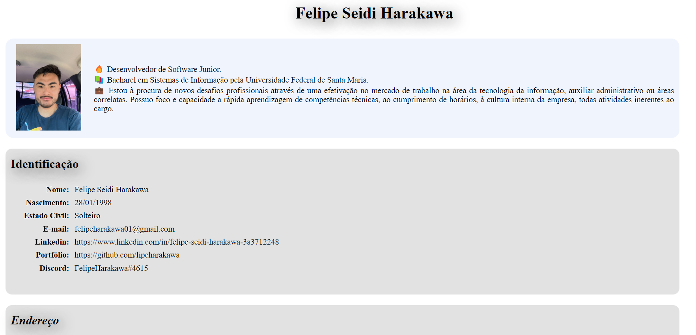

<h1 align="center">Currículo de Felipe Seidi Harakawa</h1>

Página Web do meu Currículo feito em HTML e CSS 

  <a href="#-tecnologias">Tecnologias</a>     |    
  <a href="#-projeto">Projeto</a>     |    
  <a href="#-licença">Licença</a>

  

 

  

## 🚀 Tecnologias

Esse projeto foi desenvolvido com as seguintes tecnologias:

- HTML
- CSS
- Git
- Github
- Visual Studio Code

## 💻 Projeto

Página Web do meu Currículo feito em HTML e CSS, utilizando conceitos de HTML Semântico e CSS Flexbox. As seções são divididas em “cards” que se adaptam de acordo com as diferentes resoluções de telas (Responsivo).

- [ Visite o projeto online ](https://lipeharakawa.github.io/curriculo-html-css)

## ✅ Licença

© Esse projeto está sob a licença MIT.

---

Feito com 🧡 por Felipe Seidi Harakawa 👋.
